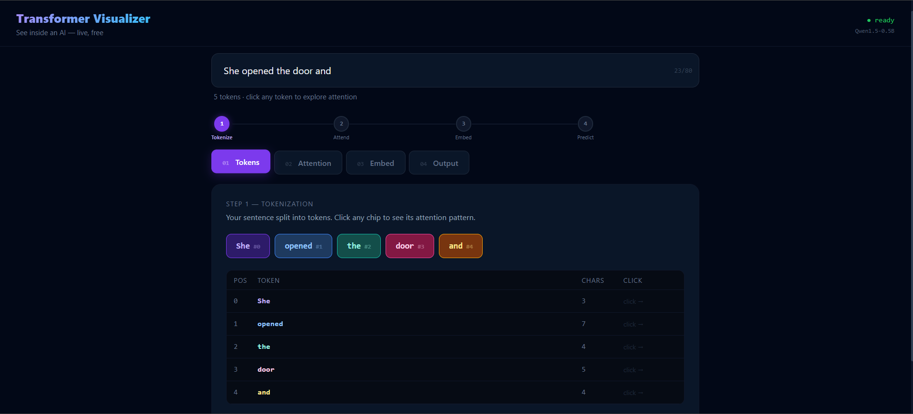
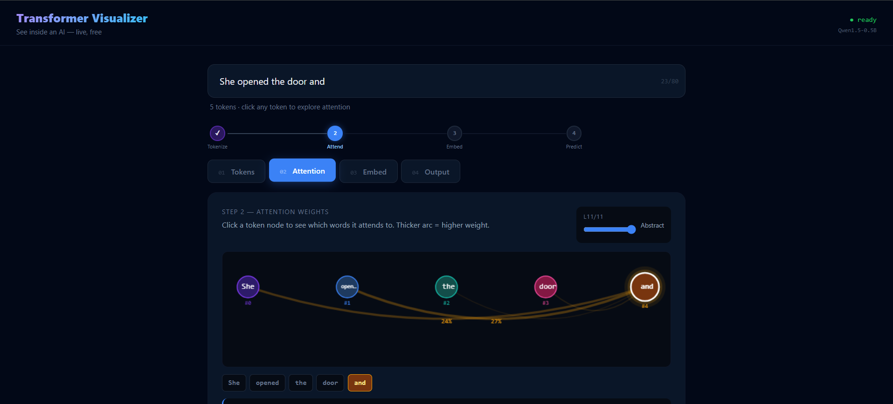
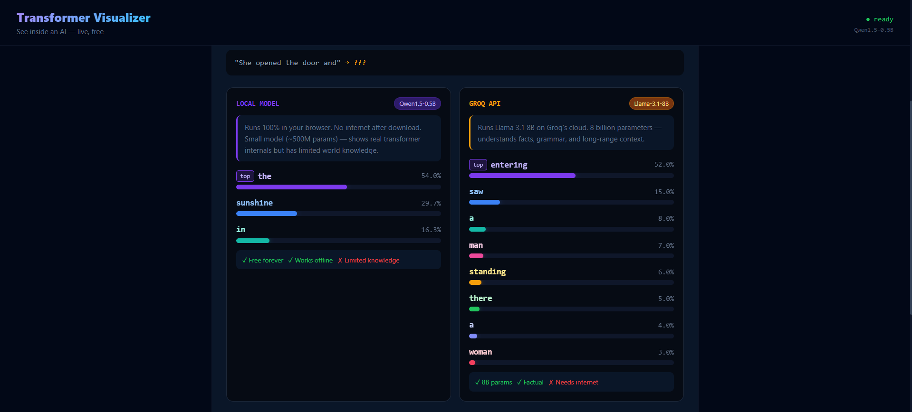

<div align="center">

# Neural Lens

### See inside an AI. Live in your browser, zero cost

[](https://neural-lens.vercel.app)

[](https://github.com/Arpitt-19/neural-lens)

[](https://react.dev)

[](LICENSE)

</div>

---

## What is this?

Neural Lens is a transformer visualizer that lets anyone see exactly how a Neural Lens reads and understands language. The Neural Lens is a transformer visualizer that lets anyone see exactly how the Neural Lens reads and understands language.

Type any sentence. Watch the Neural Lens process it in time across 4 steps:

| Step | What you see |

|------|-------------|

| **01 Tokens** | Your sentence split into the pieces the Neural Lens reads |

| **02 Attention** | Animated arcs showing which words the Neural Lens focuses on

| **03 Embeddings** | Each token as a row of 768 numbers. Meaning as math |

| **04 Output** | Next-word probabilities from two models simultaneously |

---
---
## Screenshots

### Tokens tab — sentence split into colored chips


### Attention tab — animated arcs showing word relationships


### Output tab — local model vs Groq side by side



## Why this is different

Most AI explainers show you diagrams about transformers.. This shows you the actual Neural Lens. Real model weights, real attention matrices, real logits. Running live in your browser. No backend. No server. No cost. The Neural Lens is different because it shows you the Neural Lens.

---

## The dual-model output

The Output tab runs two models simultaneously. Shows the gap between them:

```

"The capital of France is" → ???

LOCAL MODEL (Qwen 500M)     GROQ / LLAMA 3.1 (8B)

─────────────────────────   ─────────────────────────

the        46.3%            Paris      89.2%

city       25.5%            France      6.1%

8.2%            the         3.4%

```

This comparison is the most important lesson in modern AI: the architecture is identical. Only scale differs. The Neural Lens is used to compare the two models.

---

## Tech stack

| Tool | Role | Why |

|------|------|-----|

transformers.js` | Local AI inference | Real model weights in the browser via WebAssembly |

D3.js` | Attention animation | Data-bound SVG with smooth transitions |

| `React + Vite` | UI framework | Component model for interactive state |

| `Tailwind CSS` | Styling | Consistent design system |

| `Groq API` | Cloud predictions | Llama 3.1 8B for accurate next-word prediction |

| `Vercel` | Hosting | Free, global CDN auto-deploys |

The Neural Lens uses these tools to make it work. ** Cost to run: ₹0**

---

## How it works. The math

### Tokenization

Text → token IDs from a 50,257-word vocabulary.

`"` → `["un" "happy"]` → `[403, 6568]`

### Attention

```

Attention(Q, K, V) = softmax(QK^T / sqrt(d_k)) * V

```

Every token creates a Query, Key and Value vector. Arc thickness in the visualizer = the softmax score between two tokens. The Neural Lens uses attention to focus on the words.

### Embeddings

Each token → 768-dimensional vector.

Similar words cluster close in this space.

`cat` ≈ `kitten` ≠ `democracy`

### Next-token prediction

```

P(next token) = softmax(logits) over 50,257 items

```

The model scores every possible next word. We extract the logits from the models forward pass. The Neural Lens uses these logits to predict the word.

---

## Getting started

### Prerequisites

- Node.js 18+

- A Groq API key](https://console.groq.com) (no credit card)

### Installation

```bash

# Clone the repo

git clone https://github.com/Arpitt-19/neural-lens.git

cd neural-lens

# Install dependencies

npm install

# Add your Groq

echo "VITE_GROQ_KEY=your_key_here" >.env

# Start development server

npm run dev

```

Open `http://localhost:5173`

> The local AI model (~350MB) downloads on visit and is cached permanently. After that it works offline.

### Build for production

```bash

npm run build

```

---

## Deploy to Vercel (

```bash

npm install -g vercel

vercel login

vercel --prod

```

Your app is live at `https://neural-lens-yourname.vercel.app`

---

## Project structure

```

neural-lens/

├── src/

│   ├── App.jsx              # Main UI. All 4 tabs

│   ├── useTransformer.js    # Local model inference hook

│   └── claudepredict.js     # Groq API integration

├── public/

├──.env                     # API keys (never committed)

├──.gitignore

├── package.json

── vite.config.js

```

---

## What the interviewer will ask

**Q: Why transformers.js instead of an API?**

A: The project visualizes model internals. Actual attention weights and logits. An API returns generated text, not the internal state. `Transformers.js` gives us the forward pass. The Neural Lens uses transformers.js to get the forward pass.

**Q: Why is the local model accurate than Groq?**

A: Scale. The local model has 500M parameters trained on 40GB of text. Llama 3.1 has 8B parameters trained on trillions of tokens. Same architecture, math. Only parameters differ. This gap is the insight of the project. The Neural Lens shows the difference in scale.

**Q: What does the attention visualization actually show?**

A: The real softmax scores from `Attention(Q,K,V) = softmax(QK^T / sqrt(d_k)) * V` averaged across all attention heads for the selected layer. Not simulated. Extracted from the actual model weights. The Neural Lens shows the attention visualization.

**Q: How do you extract the logits?**

A: We call `model.model(inputs)` directly. Bypassing the pipelines generation loop. And read `output.logits[0 seqLen-1 :]`. Apply softmax. Top-K gives us the real probability distribution. The Neural Lens extracts the logits.

---

## What I learned building this

- Transformer architecture: tokenization, positional encoding, multi-head attention feed-forward layers, softmax output

- `transformers.js`. Running ML models in the browser via WebAssembly

- Why model scale matters. The same architecture performs completely differently at 500M vs 8B parameters

- D3.js data binding and animated SVG transitions

- React hooks for complex async state (model loading, parallel inference)

---

## Acknowledgements

- [Hugging Face](https://huggingface.co).. Open model weights

- [Groq](https://groq.com). Free API, for Llama inference

- [Jay Alammar](https://jalammar.github.io). "The Illustrated Transformer”. The explanation of attention ever written

---

<div align="center">

Built by **Arpit** · [GitHub](https://github.com/Arpitt-19) · [Live Demo](https://neural-lens.vercel.app)

*If this helped you understand transformers give it a ⭐*

</div>

